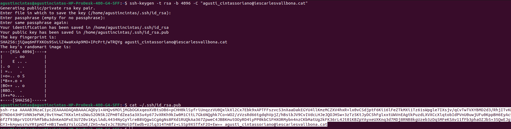

## Abans de crear el nostre primer repositori, haurem de configurar el nostre compte de GitHub amb una clau SSH per tal de poder-nos-hi connectar des del nostre ordinador. Seguiu el tutorial de la pàgina web de GitHub on indica com crear una clau SSH i el tutorial on explica com afegir la clau a GitHub. Inclou captures de pantalla del terminal on has creat el certificat i de la web de GitHub amb el certificat configurat.

